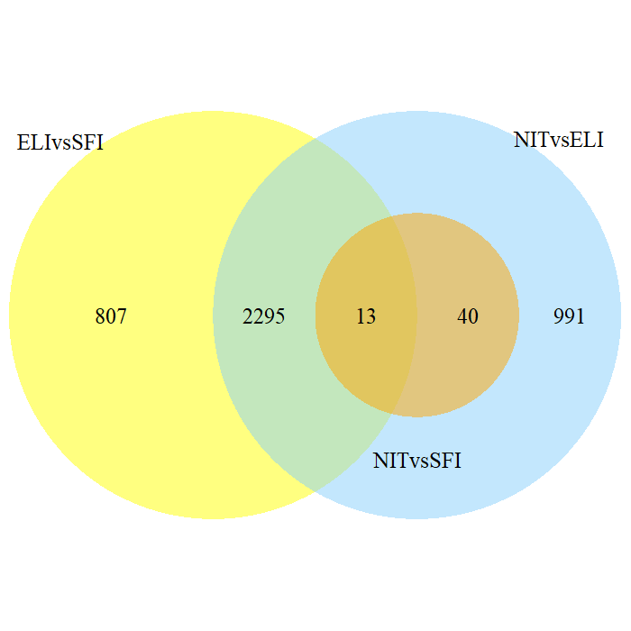

<font size="6">
**Enlace al GitHub:**https://github.com/LorenaGaMo/Gallardo_Lorena_ADO_PEC2.git
</font>

\newpage
```{r setup, include=FALSE}
library(knitr)
knitr::opts_chunk$set(echo = TRUE, message = FALSE, warning = FALSE, 
                      comment = NA, prompt = TRUE, tidy = FALSE, 
                      fig.width = 7, fig.height = 7, fig_caption = TRUE,
                      cache=FALSE)

```

# ABSTRACT

En esta PEC se quiere hacer un análisis de datos RNA-seq de treinta muestras a partir de un estudio con muestras de células del tejido tiroidal, a las que se les ha aplicado diferentes tratamientos. Estas treinta muestras están divididas en tres grupos de diez que corresponde a los tres tratamientos de infiltración que se llevó a cabo. 
Con el análisis de datos se buscaron las diferencias significativas de la expresión génica de los diferentes grupos.


# OBJETIVOS

El objetivo de este trabajo es comparar los niveles de expresión génica de estos tres grupos de muestras de tejido tiroidal dos a dos para obtener un listado de genes que se expresan de manera diferencial tanto los sobre expresados como subexpresados. En este caso haremos un experimento de comparación de clases. 
Las tres comparaciones posibles:
- NIT vs SFI: Para comparar el efecto del tratamiento SFI con no tratados.
- NIT vs ELI: Para comparar el efecto del tratamiento ELI con no tratados.
- ELI vs SFI: Para comparar los dos tratamientos.


# MATERIAL Y MÉTODOS

## Software y naturaleza de los datos

El software utilizado para realizar este estudio es el siguiente: R ^[https://cran.r-project.org/index.html] (versión 3.6.1) con el interfaz RStudio ^[https://www.rstudio.com/] y los paquetes de Bioconductor Affy ^[https://www.bioconductor.org/] (versión 3.10). Se ha utilizado el paquete `DESeq` para el filtraje de los datos y determinar cuantitativamente la diferencia de expresión en las diferentes comparaciones.Para realizar el análisis Over-Representation Analysis se ha utilizado el paquete `clusterProfiler` y la base de datos de anotaciones del genoma humano `org.Hs.eg.db`. 
Este trabajo se ha realizado a partir de unos datos extraídos del repositorio del proyecto Genotype-Tissue Expression (GTEx) ^ [https://www.gtexportal.org/home/]. Estos datos se corresponden a un análisis de 292 muestras de tiroides en el que se comparan tres tipos de infiltraciones:
•	*Not infiltrated tissues * (NIT): 236 muestras
•	*Small focal infiltrados * (SFI): 42 muestras
•	*Extensive lymphoid infiltrados * (ELI): 14 muestras

Se trata de un archivo con los datos de conteos ya procesados `counts.csv` y de un archivo con los grupos y las covariables `targets.csv`.


## Preparación de los datos

Antes de empezar con el analisi propiamente se debe preparar el entorno de trabajo con un sistema de archivos. El hecho de tener la información bien estructurada facilita el proceso del analisis. Es recomendable tener instaladas las librerias necesarias ya que el proceso puede ser largo.
Para simplificar los cálculos y para igualar el número de muestras de los distintos grupos, en este trabajo se pidió utilizar 10 muestras aleatorias de cada grupo.
En el que en primer lugar se separaron del archivo `targets.csv` las muestras según el grupo (ELI, SFI o NIT) y después con la función `sample` se aleatorizaron diez muestras de cada uno., las cuales se unieron en un mismo dataframe posteriormente.
El siguiente paso fue seleccionar los contajes correspondientes a las muestras donde se utilizó la variable `Sample_Name` como filtro.

Para simplificar los cálculos y para igualar el número de muestras de los distintos grupos, en este trabajo se pidió utilizar 10 muestras aleatorias de cada grupo.
En el que en primer lugar se separaron del archivo `targets.csv` las muestras según el grupo (ELI, SFI o NIT) y después con la función `sample` se aleatorizaron diez muestras de cada uno., las cuales se unieron en un mismo dataframe posteriormente.
El siguiente paso fue seleccionar los contajes correspondientes a las muestras donde se utilizó el paquete `dplyr` quedándonos con las treinta columnas de `counts.csv` que nos interesaban. Pero previamente se cambiaron los guiones por puntos para que coincidan con los nombres de las muestras en el dataframe de counts .

Y finalmente se guardan los nuevos archivos en la carpeta `data` previamente creada.(script completo en el apéndice)

```{r message=FALSE, warning=FALSE, include=FALSE}
# Librerias necesarias
library("GenomicAlignments")
library("BiocParallel")
library("DESeq2")
library("readxl")
library("genefilter")
library("AnnotationDbi")
library("org.Hs.eg.db")
library("dplyr")
library("ggplot2")
library("vsn")
library("pheatmap")
library("RColorBrewer")
library("VennDiagram")
library("clusterProfiler")
```
```{r, eval=FALSE}
setwd(".")
dir.create("data")
dir.create("results")
dir.create("figuras")
```
```{r Lectura de los archivos de datos, message=FALSE, warning=FALSE, include=FALSE}

targets <- read.csv("./data/targets.csv")
counts <- read.csv("./data/counts.csv", sep = ";")

# Se comprueba si hay o no NA
sum(is.na(targets))
sum(is.na(counts))
```
```{r extracción y selección de los datos, message=FALSE, warning=FALSE, include=FALSE}
#Separamos por grupos el dataframe
nit <- subset(targets, Group == "NIT")
sfi <- subset(targets, Group == "SFI")
eli <- subset(targets, Group == "ELI")

#Selección al azar de 10 muestras de cada grupo y creación de un nuevo dataframe con la selección
set.seed(2704)
sel_nit <-nit [sample(nrow(nit), size = 10, replace = FALSE),]
sel_sfi <- sfi[sample(nrow(sfi), size = 10, replace = FALSE),]
sel_eli <- eli[sample(nrow(eli), size = 10, replace = FALSE),]
sel_targets <- rbind(sel_nit, sel_sfi, sel_eli, deparse.level = 0)
```
```{r extracción de los nombres de las muestras, message=FALSE, warning=FALSE, include=FALSE}
#Se cambian los guiones por puntos para que coincidan con los nombres de las muestras en el dataframe de counts y se extraen los nombres

colnames(counts) <- gsub("\\.", "-", colnames(counts))

nom_mostres <- sel_targets[,3]

# en el dataframe de counts
sel_counts <- dplyr::select(counts, nom_mostres)
row.names(sel_counts) <- counts$X
```
```{r message=FALSE, warning=FALSE, include=FALSE}
#Se definen nombres cortos a las columnas

short_name <- c(paste("NIT", c(1:10), sep = "."), paste("SFI", c(1:10), sep = "."), paste("ELI", c(1:10), sep = "."))
sel_targets <- cbind(sel_targets, short_name)
#Se introducen en el dataframe sel_counts
colnames(sel_counts) <- sel_targets$short_name
```
```{r message=FALSE, warning=FALSE, include=FALSE}
#Se guardan los nuevos archivos:


write.csv(sel_targets, file = "./data/selected_targets.csv")
write.csv(sel_counts, file = "./data/selected_counts.csv")


```
## Creación objeto *DESeqDataSet*

Se ha utilizado el paquete `DESeq2` de Bioconductor para realizar el análisis de expresión diferencial que se muestra a continuación.
Pero para poder utilizar las funciones de este paquete previamente se debe creas un objeto ` DESeqDataSet` con la función ` DESeqDataSetFromMatrix`.

```{r message=FALSE, warning=FALSE, include=FALSE}
dds <- DESeqDataSetFromMatrix(countData = sel_counts, colData = sel_targets, design = ~ Group)
dds
```
## Filtraje

Para reducir la información del objeto y agilizar el analisis se realiza un filtraje para retirar las filas sin nigún conteo. El número de genes obtenidos tras este filtrado es 43108.

Visualizamos la distribución de los datos obtenidos mediante un boxplot.
```{r message=FALSE, warning=FALSE, include=FALSE}
dds <- dds[rowSums(counts(dds)) > 1, ]

nrow(dds)
```
```{r message=FALSE, warning=FALSE, echo=FALSE,fig.align='center', out.width= '75%',fig.cap= "Boxplot de los datos crudos"}
boxplot(counts(dds), border = c(rep("yellow", 10), rep("green3", 10), rep("blue", 10)), ylab = "Count", xlab = "Muestras", main = "Boxplot de los datos crudos", cex.main = 1.1, cex.lab = 0.9, cex.axis = 0.8, las = 3)
```

## Normalización

Como se ha podido observar los datos no presentan homocedasticidad por lo que se procede ha normalizar los mismos mediante la función `vst` que normaliza los datos siguiendo el concepto de de transformación estabilizadora de varianzas.Aunque menos sensible a los contajes ellevados es más rápida en el análisis.

```{r message=FALSE, warning=FALSE, echo=FALSE}
vsd <- vst(dds, blind = FALSE)
head(assay(vsd))
```

Volvemos a genera un boxplot para visualizar de nuevo nuestros datos. Esta vez podemos observar que se ha ganado en hocedasticidad.

```{r message=FALSE, warning=FALSE, echo=FALSE, fig.align='center', out.width= '75%',fig.cap= "Boxplot de los datos transformados mediante la función 'vst'" }
boxplot(assay(vsd), border = c(rep("yellow", 10), rep("green", 10), rep("blue", 10)), ylab = "Count", xlab = "Muestras", main = "Boxplot de los datos transformados", cex.main = 1.1, cex.lab = 0.9, cex.axis = 0.8, las = 3)
```
Mediante el gráfico siguiente donde se muestra la desviación estándar en función de la media se puede corroborar que la desviación estándar es suficientemente baja y aceptar la transformación de los datos realizada, a pesar de que haya outliners.

```{r message=FALSE, warning=FALSE, echo=FALSE,fig.align='center', out.width= '75%',fig.cap= "Gráfico de la desviación estandar en función de de la media" }

meanSdPlot(assay(vsd))

``` 

## Clusterización de los datos

Se calcula la distancia euclídea entre las diferentes muestras con los datos transformados para un análisis de visualización. Con estas distancias se puede generar un mapa de calor que permite analizar si el diseño del experimento ha sido correcto.

```{r message=FALSE, warning=FALSE, echo=FALSE,fig.align='center', out.width= '75%',fig.cap= "Heatmap de la similitudes entre las muestras"}
# Calculo de las distinas entre las muestras:
distancia <- dist(t(assay(vsd)))
dist_matrix <- as.matrix(distancia)

colnames(dist_matrix) <- NULL
colors <- colorRampPalette(rev(brewer.pal(9,"YlGn")))(200)
pheatmap(dist_matrix, clustering_distance_rows = distancia,
         clustering_distance_cols = distancia, col = colors)
```

En el mapa de calor se puede observar que las muestras NIT y las muestras ELI no estan relacionadas mientras que algunas muestras SFI estan agrupadas junto las NIT y dos de ellas ( SFI.3 y  SFI.8) se agrupan junto a las muestras ELI.

```{r message=FALSE, warning=FALSE, echo=FALSE,fig.align='center', out.width= '75%',fig.cap= "PCA de la similitudes entre las muestras"}
# Gráfico PCA :
plotPCA(vsd, intgroup = c("Group"))

```

El gràfico de componentes principales corrobora los agrupamientos mencionados, NIT por un lado y ELI por otro con muestras de SFI repartida en ambos grupos. En este gráfico tambien podemos observar que el eje x explica el 59% de la variabilidad.

# RESULTADOS y DISCUSIÓN

##  Análisis de expresión diferencial

En este paso se quiere determinar cuantitativamente la diferencia de experesión genica en las tres comparaciónes mediante la función `results`.

De los genes resultantes se filtraron quedandonos solo con los que tenian un p-valor < 0.01 y así resumir la cantidad de genes obtenidos. posteriormente se ordenaron y se obtuvieron los quince que se encontraban mas sobre expresados y los quince mas subextresados.

```{r message=FALSE, warning=FALSE, include=FALSE}

dds <- DESeq(dds, parallel = TRUE)
```            
```{r message=FALSE, warning=FALSE, include=FALSE}
# Contraste entre las comparaciones de los grupos:
resNitSfi <- results(dds, contrast = c("Group", "NIT", "SFI"))
resEliSfi <- results(dds, contrast = c("Group", "ELI", "SFI"))
resNitEli <- results(dds, contrast = c("Group", "NIT", "ELI"))


```
```{r message=FALSE, warning=FALSE, echo=FALSE}
# Resumen de las comparaciones
summary(resNitSfi)
summary(resEliSfi)
summary(resNitEli)
```
```{r message=FALSE, warning=FALSE, include=FALSE}
# Buscamos los 15 genes más sobreexpresados y los 15 genes más subexpresados en cada comparación
adjRNS <- subset(resNitSfi, padj < 0.01)
adjRES <- subset(resEliSfi, padj < 0.01)
adjRNE <- subset(resNitEli, padj < 0.01)
#Sobreesxpresados
head(adjRNS[order(adjRNS$log2FoldChange),],15)
head(adjRES[order(adjRES$log2FoldChange),],15)
head(adjRNE[order(adjRNE$log2FoldChange),],15)

#Subexpresados
head(adjRNS[order(adjRNS$log2FoldChange, decreasing = T),],15)
head(adjRES[order(adjRES$log2FoldChange, decreasing = T),],15)
head(adjRNE[order(adjRNE$log2FoldChange, decreasing = T),],15)
```
## Visualización de los genes mas diferenciados en su expresión

Para visualizar los agrupamientos sentre ciertos genes y ciertas muestras se realizo un mapa de calor y en esta se puede observar que se producen agrupamientos entre los genes sobre expresados y los subexpresados.

```{r message=FALSE, warning=FALSE, echo=FALSE, fig.align='center', out.width= '75%',fig.cap= "Heatmap de los genes mas diferenciados"}
dif_genes <- head(order(rowVars(assay(vsd)), decreasing = TRUE), 15)
mdif_genes <- assay(vsd)[dif_genes, ]
mdif_genes <- mdif_genes - rowMeans(mdif_genes)
anno <- as.data.frame(colData(vsd)[,c("Group")])
pheatmap(mdif_genes, annotacion_col = anno)
```
```{r message=FALSE, warning=FALSE, include=FALSE}
genesRNS <- rownames(as.data.frame(adjRNS))
genesRES <- rownames(as.data.frame(adjRES))
genesRNE <- rownames(as.data.frame(adjRNE))
venn.diagram(list(genesRNS, genesRES, genesRNE), category.names = c("NITvsSFI", "ELIvsSFI", "NITvsELI"), filename = "./Figuras/DiagramaVenn.png", output = TRUE, imagetype="png", width = 700, height = 700, lwd = 2, lty = 'blank', fill = c("orange", "yellow", "lightskyblue"), cat.cex = 0.3, cex = 0.3)
```

Se representan los resultados en un diagrama de Venn mediante la función` venn.diagram` del paquete ` VennDiagram `para comprobar si los genes diferencialmente expresados que se obtienen mediante la función `results` son compartidos por más de una de las comparaciones.Se observa como la mayoría de genes que están diferencialmente expresados en la comparación entre ELI y SFI también lo están entre ELI y NIT.Y que todos los que se exprresan diferencialmente en NIT y SFI estan incluidos en los de NIT y ELI.


```{r message=FALSE, warning=FALSE, echo=FALSE, fig.align='center', out.width= '75%',fig.cap= "Diagrama de Venn de los genes diferenciados"}


```

En el gráfico MA se representa la media de los coeficientes en eje x (A) mientras que en el eje y (M) se representa la resta de los valores logarítmicos, lo que muestra la distribución de los coeficiente estimados en el modelo en todos los genes.
Se observa que en la comparación SFI y ELI los genes estan sobre expresados en cambio en las otras dos comparaciones es la contrario estan subexpresados.

```{r message=FALSE, warning=FALSE, echo=FALSE, fig.align='center', out.width= '75%',fig.cap= "MAplot de las diferentes comparaciones"}
par(mfrow = c(3, 1))
plotMA(adjRNS, alpha = 0.1, main = "Comparación NIT vs SFI",
  xlab = "mean of normalized counts", ylim= c(-10,10), colNonSig = "gray60",
  colSig = "red", colLine = "grey40",
  MLE = FALSE)
plotMA(adjRES, alpha = 0.1, main = "Comparación ELI vs SFI",
  xlab = "mean of normalized counts", ylim= c(-10,10), colNonSig = "gray60",
  colSig = "red", colLine = "grey40",
  MLE = FALSE)
plotMA(adjRNE, alpha = 0.1, main = "Comparación NIT vs ELI",
  xlab = "mean of normalized counts", ylim= c(-10,10), colNonSig = "gray60",
  colSig = "red", colLine = "grey40",
  MLE = FALSE)
```
## Anotación
Para el análisis se han utilizado los identificadores de genes los d'ENSEMBL pero nos interesa añadir tambien los identificadores de SYMBIOL y d'ENTREZ.
Para añadir esta información se utiliza las anotaciones de los paquetes `AnnotationDbi` y `org.Hs.eg.db` que se anotan en las tres tablas de resultados obtenidas de las tres comparaciones.
 

```{r message=FALSE, warning=FALSE, include=FALSE }
adjRNS$symbol <- mapIds(org.Hs.eg.db, keys = substr(rownames(adjRNS), 1, 15), column = "SYMBOL", keytype = "ENSEMBL", multiVals = "first")
adjRNS$entrez <- mapIds(org.Hs.eg.db, keys = substr(rownames(adjRNS), 1, 15), column = "ENTREZID", keytype = "ENSEMBL", multiVals = "first")
adjRES$symbol <- mapIds(org.Hs.eg.db, keys = substr(rownames(adjRES), 1, 15), column = "SYMBOL", keytype = "ENSEMBL", multiVals = "first")
adjRES$entrez <- mapIds(org.Hs.eg.db, keys = substr(rownames(adjRES), 1, 15), column = "ENTREZID", keytype = "ENSEMBL", multiVals = "first")
adjRNE$symbol <- mapIds(org.Hs.eg.db, keys = substr(rownames(adjRNE), 1, 15), column = "SYMBOL", keytype = "ENSEMBL", multiVals = "first")
adjRNE$entrez <- mapIds(org.Hs.eg.db, keys = substr(rownames(adjRNE), 1, 15), column = "ENTREZID", keytype = "ENSEMBL", multiVals = "first")

# Se guardan ordenados 
ordRNS <- as.data.frame (adjRNS[order(adjRNS$pvalue),])
ordRES <- as.data.frame (adjRES[order(adjRES$pvalue),])
ordRNE <- as.data.frame (adjRNE[order(adjRNE$pvalue),])
write.csv(ordRNS, file = "./results/ordRNS.csv")
write.csv(ordRES, file = "./results/ordRES.csv")
write.csv(ordRNE, file = "./results/ordRNE.csv")
```
## Análisis significación biológica
 
Se realiza un análisi de significación biologica con  Over-Representation Analysis para poder ver que procesos biologicos estan involucrados.Este metodo nos permite comprovar los genes involucrados en determinados procesos biológicos.
Se han seleccionado los que tienen un p-valor < 0.01 y un lofFC superior a 2 i asi reducir el numero de genes.
Los resultados se han representado con las funciones `barplot`y `cnetplot`.
```{r message=FALSE, warning=FALSE, echo=FALSE}


listOfTables <- list(adjRNS, adjRES, adjRNE)
list_names <- list("NITvsSFI", "ELIvsSFI", "NITvsELI")
selected_gens <- list()

for (i in 1:length(listOfTables)) {
  topTap <- listOfTables[[i]]
  df <- as.data.frame(topTap)[order(topTap$log2FoldChange, decreasing = TRUE), c(2, 7)]
  df <- na.omit(df)
  list_gens <- df[, 1]
  names(list_gens) <- df[, 2]
  selected_gens[[i]] <- list_gens
  names(selected_gens)[i] <- list_names[i]
}
sapply(selected_gens, length)


sig_gens <- list()

for (i in 1:length(listOfTables)) {
  topTap <- listOfTables[[i]]
  df <- as.data.frame(topTap)[order(topTap$log2FoldChange, decreasing = TRUE), c(2, 7)]
  df <- na.omit(df)
   sigTab <- subset(topTap, topTap$padj < 0.01 & abs(topTap$log2FoldChange) > 2)
  entrezid <- sigTab$entrez
  sig_gens[[i]] <- as.character(entrezid[!is.na(entrezid)])
  names(sig_gens)[i] <- list_names[i]
}

sapply(sig_gens, length)

```

Se puede observar en los resultados del barplot  que los genes que se expresan diferencialmente estan involucradis en procesos biologicos de defensa, donde se activan los linfocitos, celulas T y mecanismos del sistema immune.

```{r message=FALSE, warning=FALSE, include=FALSE}

mapped_genes2GO <- mappedkeys(org.Hs.egGO)
mapped_genes2KEGG <- mappedkeys(org.Hs.egPATH)
mapped_genes <- union(mapped_genes2GO, mapped_genes2KEGG)


```
```{r message=FALSE, warning=FALSE, echo=FALSE}

universe <- mapped_genes
for (i in 1:length(sig_gens)){
  gens <- sig_gens[[i]]
  comparison <- names(sig_gens[i])
  eGO <- enrichGO(gene = gens, universe = universe, OrgDb = org.Hs.eg.db, ont = "BP", pAdjustMethod = "BH", pvalueCutoff = 0.01, qvalueCutoff = 0.05, readable = TRUE)
  
 
  if (nrow(eGO) != 0) {
    write.csv(as.data.frame(eGO), file = paste0("./results/EnrichGO_", comparison, ".csv"), row.names = FALSE)
    
    
    print(barplot(eGO, showCategory = 10, font.size = 6, title = paste0("Análisis procesos biológicos significativos ", comparison, ". Barplot")))
    
   
    print(cnetplot(eGO, categorySize = "geneNum",font.size=6, showCategory = 3, foldChange = selected_gens[[i]], vertex.label.cex = 0.7))
  }
}
```


## Resumen de resultados
```{r}
Result_Files <- dir("./results/") 
knitr::kable(
  Result_Files, booktabs = TRUE,
  caption = "Listado de ficheros de resultados",
  col.names="Ficheros"
)
```


# APÉNDICE

```{r eval= FALSE}
library(knitr)
knitr::opts_chunk$set(echo = TRUE, message = FALSE, warning = FALSE, 
                      comment = NA, prompt = TRUE, tidy = FALSE, 
                      fig.width = 7, fig.height = 7, fig_caption = TRUE,
                      cache=FALSE)

# Librerias necesarias
library("GenomicAlignments")
library("BiocParallel")
library("DESeq2")
library("readxl")
library("ggbeeswarm")
library("genefilter")
library("AnnotationDbi")
library("org.Hs.eg.db")
library("dplyr")
library("ggplot2")
library("vsn")
library("pheatmap")
library("RColorBrewer")
library("VennDiagram")
library("clusterProfiler")

targets <- read.csv("./data/targets.csv")
counts <- read.csv("./data/counts.csv", sep = ";")

# Se comprueba si hay o no NA
sum(is.na(targets))
sum(is.na(counts))

#Separamos por grupos el dataframe
nit <- subset(targets, Group == "NIT")
sfi <- subset(targets, Group == "SFI")
eli <- subset(targets, Group == "ELI")

#Selección al azar de 10 muestras de cada grupo y creación de un nuevo dataframe con la selección
set.seed(2704)
sel_nit <-nit [sample(nrow(nit), size = 10, replace = FALSE),]
sel_sfi <- sfi[sample(nrow(sfi), size = 10, replace = FALSE),]
sel_eli <- eli[sample(nrow(eli), size = 10, replace = FALSE),]
sel_targets <- rbind(sel_nit, sel_sfi, sel_eli, deparse.level = 0)

#Se cambian los guiones por puntos para que coincidan con los nombres de las muestras en el dataframe de counts y se extraen los nombres

colnames(counts) <- gsub("\\.", "-", colnames(counts))

nom_mostres <- sel_targets[,3]

# en el dataframe de counts
sel_counts <- dplyr::select(counts, nom_mostres)
row.names(sel_counts) <- counts$X

#Se definen nombres cortos a las columnas

short_name <- c(paste("NIT", c(1:10), sep = "."), paste("SFI", c(1:10), sep = "."), paste("ELI", c(1:10), sep = "."))
sel_targets <- cbind(sel_targets, short_name)
#Se introducen en el dataframe sel_counts
colnames(sel_counts) <- sel_targets$short_name

#Se guardan los nuevos archivos:


write.csv(sel_targets, file = "./data/selected_targets.csv")
write.csv(sel_counts, file = "./data/selected_counts.csv")

dds <- DESeqDataSetFromMatrix(countData = sel_counts, colData = sel_targets, design = ~ Group)
dds

# Filtraje

dds <- dds[rowSums(counts(dds)) > 1, ]

nrow(dds)


boxplot(counts(dds), border = c(rep("yellow", 10), rep("green3", 10), rep("blue", 10)), ylab = "Count", xlab = "Muestras", main = "Boxplot de los datos crudos", cex.main = 1.1, cex.lab = 0.9, cex.axis = 0.8, las = 3)

# Normalización

vsd <- vst(dds, blind = FALSE)
head(assay(vsd))

boxplot(assay(vsd), border = c(rep("yellow", 10), rep("green", 10), rep("blue", 10)), ylab = "Count", xlab = "Muestras", main = "Boxplot de los datos transformados", cex.main = 1.1, cex.lab = 0.9, cex.axis = 0.8, las = 3)

meanSdPlot(assay(vsd))

# Calculo de las distinas entre las muestras:
distancia <- dist(t(assay(vsd)))
dist_matrix <- as.matrix(distancia)

colnames(dist_matrix) <- NULL
colors <- colorRampPalette(rev(brewer.pal(9,"YlGn")))(200)
pheatmap(dist_matrix, clustering_distance_rows = distancia,
         clustering_distance_cols = distancia, col = colors)

# Gráfico PCA :
plotPCA(vsd, intgroup = c("Group"))


 
#  Análisis de expresión diferencial

dds <- DESeq(dds, parallel = TRUE)
            


# Contraste entre las comparaciones de los grupos:
resNitSfi <- results(dds, contrast = c("Group", "NIT", "SFI"))
resEliSfi <- results(dds, contrast = c("Group", "ELI", "SFI"))
resNitEli <- results(dds, contrast = c("Group", "NIT", "ELI"))


# Resumen de las comparaciones
summary(resNitSfi)
summary(resEliSfi)
summary(resNitEli)

# Buscamos los 15 genes más sobreexpresados y los 15 genes más subexpresados en cada comparación
adjRNS <- subset(resNitSfi, padj < 0.01)
adjRES <- subset(resEliSfi, padj < 0.01)
adjRNE <- subset(resNitEli, padj < 0.01)
#Sobreesxpresados
head(adjRNS[order(adjRNS$log2FoldChange),],15)
head(adjRES[order(adjRES$log2FoldChange),],15)
head(adjRNE[order(adjRNE$log2FoldChange),],15)

#Subexpresados
head(adjRNS[order(adjRNS$log2FoldChange, decreasing = T),],15)
head(adjRES[order(adjRES$log2FoldChange, decreasing = T),],15)
head(adjRNE[order(adjRNE$log2FoldChange, decreasing = T),],15)

# Visualización de los genes mas diferenciados en su expresión


dif_genes <- head(order(rowVars(assay(vsd)), decreasing = TRUE), 20)
mdif_genes <- assay(vsd)[dif_genes, ]
mdif_genes <- mdif_genes - rowMeans(mdif_genes)
anno <- as.data.frame(colData(vsd)[,c("Group")])
pheatmap(mdif_genes, annotacion_col = anno)


genesRNS <- rownames(as.data.frame(adjRNS))
genesRES <- rownames(as.data.frame(adjRES))
genesRNE <- rownames(as.data.frame(adjRNE))
venn.diagram(list(genesRNS, genesRES, genesRNE), category.names = c("NITvsSFI", "ELIvsSFI", "NITvsELI"), filename = "./Figuras/DiagramaVenn.png", output = TRUE, imagetype="png", width = 700, height = 700, lwd = 2, lty = 'blank', fill = c("orange", "yellow", "lightskyblue"), cat.cex = 0.3, cex = 0.3)


par(mfrow = c(3, 1))
plotMA(adjRNS, alpha = 0.1, main = "Comparación NIT vs SFI",
  xlab = "mean of normalized counts", ylim= c(-10,10), colNonSig = "gray60",
  colSig = "red", colLine = "grey40",
  MLE = FALSE)
plotMA(adjRES, alpha = 0.1, main = "Comparación ELI vs SFI",
  xlab = "mean of normalized counts", ylim= c(-10,10), colNonSig = "gray60",
  colSig = "red", colLine = "grey40",
  MLE = FALSE)
plotMA(adjRNE, alpha = 0.1, main = "Comparación NIT vs ELI",
  xlab = "mean of normalized counts", ylim= c(-10,10), colNonSig = "gray60",
  colSig = "red", colLine = "grey40",
  MLE = FALSE)

# Anatoación

adjRNS$symbol <- mapIds(org.Hs.eg.db, keys = substr(rownames(adjRNS), 1, 15), column = "SYMBOL", keytype = "ENSEMBL", multiVals = "first")
adjRNS$entrez <- mapIds(org.Hs.eg.db, keys = substr(rownames(adjRNS), 1, 15), column = "ENTREZID", keytype = "ENSEMBL", multiVals = "first")
adjRES$symbol <- mapIds(org.Hs.eg.db, keys = substr(rownames(adjRES), 1, 15), column = "SYMBOL", keytype = "ENSEMBL", multiVals = "first")
adjRES$entrez <- mapIds(org.Hs.eg.db, keys = substr(rownames(adjRES), 1, 15), column = "ENTREZID", keytype = "ENSEMBL", multiVals = "first")
adjRNE$symbol <- mapIds(org.Hs.eg.db, keys = substr(rownames(adjRNE), 1, 15), column = "SYMBOL", keytype = "ENSEMBL", multiVals = "first")
adjRNE$entrez <- mapIds(org.Hs.eg.db, keys = substr(rownames(adjRNE), 1, 15), column = "ENTREZID", keytype = "ENSEMBL", multiVals = "first")

# Se guardan ordenados 
ordRNS <- as.data.frame (adjRNS[order(adjRNS$pvalue),])
ordRES <- as.data.frame (adjRES[order(adjRES$pvalue),])
ordRNE <- as.data.frame (adjRNE[order(adjRNE$pvalue),])
write.csv(ordRNS, file = "./results/ordRNS.csv")
write.csv(ordRES, file = "./results/ordRES.csv")
write.csv(ordRNE, file = "./results/ordRNE.csv")


# Análisis significación biológica


listOfTables <- list(adjRNS, adjRES, adjRNE)
list_names <- list("NITvsSFI", "ELIvsSFI", "NITvsELI")
selected_gens <- list()

for (i in 1:length(listOfTables)) {
  topTap <- listOfTables[[i]]
  df <- as.data.frame(topTap)[order(topTap$log2FoldChange, decreasing = TRUE), c(2, 7)]
  df <- na.omit(df)
  list_gens <- df[, 1]
  names(list_gens) <- df[, 2]
  selected_gens[[i]] <- list_gens
  names(selected_gens)[i] <- list_names[i]
}
sapply(selected_gens, length)


sig_gens <- list()

for (i in 1:length(listOfTables)) {
  topTap <- listOfTables[[i]]
  df <- as.data.frame(topTap)[order(topTap$log2FoldChange, decreasing = TRUE), c(2, 7)]
  df <- na.omit(df)
   sigTab <- subset(topTap, topTap$padj < 0.01 & abs(topTap$log2FoldChange) > 2)
  entrezid <- sigTab$entrez
  sig_gens[[i]] <- as.character(entrezid[!is.na(entrezid)])
  names(sig_gens)[i] <- list_names[i]
}

sapply(sig_gens, length)


mapped_genes2GO <- mappedkeys(org.Hs.egGO)
mapped_genes2KEGG <- mappedkeys(org.Hs.egPATH)
mapped_genes <- union(mapped_genes2GO, mapped_genes2KEGG)


universe <- mapped_genes
for (i in 1:length(sig_gens)){
  gens <- sig_gens[[i]]
  comparison <- names(sig_gens[i])
  eGO <- enrichGO(gene = gens, universe = universe, OrgDb = org.Hs.eg.db, ont = "BP", pAdjustMethod = "BH", pvalueCutoff = 0.01, qvalueCutoff = 0.05, readable = TRUE)
  
 
  if (nrow(eGO) != 0) {
    write.csv(as.data.frame(eGO), file = paste0("./results/EnrichGO_", comparison, ".csv"), row.names = FALSE)
    
    
    print(barplot(eGO, showCategory = 10, font.size = 6, title = paste0("Análisis procesos biológicos significativos ", comparison, ". Barplot")))
    
   
    print(cnetplot(eGO, categorySize = "geneNum",font.size=6, showCategory = 3, foldChange = selected_gens[[i]], vertex.label.cex = 0.7))
  }
}
```

# REFERENCIAS


  - Analyzing RNA-seq data with DESeq2,Michael I. Love, Simon Anders, and Wolfgang Huber,
  https://bioconductor.org/packages/release/bioc/vignettes/DESeq2/inst/doc/DESeq2.html#theory


  - RNA-seq workflow: gene-level exploratory analysis and differential expression,
  Michael I. Love1,, Simon Anders, Vladislav Kim and Wolfgang Huber,
  https://www.bioconductor.org/packages/devel/workflows/vignettes/rnaseqGene/inst/doc/rnaseqGene.html}


  - MA-Plot From Base Means And Log Fold Changes,
  https://www.rdocumentation.org/packages/DESeq2/versions/1.12.3/topics/plotMA}


